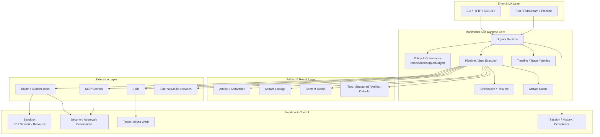

# AgentKit 多模态 Skill Runtime 技术架构与竞品对比

日期：2026-03-24

## 一句话结论

如果 `agentkit` 的目标从“通用 Go Agent 框架”切换为“面向多模态任务执行的 Skill Runtime”，那么它最该做的不是内建媒体处理算法，而是把 **artifact、multimodal tool result、pipeline、checkpoint/cache、timeline/trace、skill-first 扩展** 做成一等公民。

这条路线与 `eino` 等通用 ADK/Graph 框架不同。`eino` 更强在通用编排与 ADK 完整度，`agentkit` 更有机会在 **运行时控制、沙箱、安全、可恢复执行、技能化扩展** 这条线上建立优势。

---

## 1. 目标定位

### 1.1 不做什么

`agentkit` 不应内建这些能力：

- OCR 算法
- ASR 算法
- 视频理解模型
- 转码引擎
- 图像检测/分割模型

这些都应通过以下方式扩展：

- skill
- tool
- MCP server
- 外部服务适配器

### 1.2 真正要做什么

`agentkit` 应提供多模态 skill 的统一运行时基座：

- 统一的 artifact 模型
- 统一的多模态 tool result 协议
- 统一的 pipeline/step 执行模型
- 统一的 checkpoint/cache/resume
- 统一的 timeline/debug/trace
- 统一的权限、预算、资源治理

---

## 2. 核心技术判断

### 2.1 多模态 Agent 与 Coding Agent 的本质差异

Coding Agent 的主对象是：

- workspace
- file edit
- patch
- shell task
- test result

多模态 Agent 的主对象是：

- artifact
- artifact ref
- artifact lineage
- multimodal tool result
- pipeline step
- structured result

一句话概括：

- Coding Agent 关注“代码树和执行环境状态”
- 多模态 Agent 关注“媒体资产与派生产物流转”

这决定了多模态 runtime 的核心不是 patch，而是：

- ingest
- transform
- extract
- reason
- produce artifact/result

### 2.2 为什么要走 skill runtime 路线

如果把媒体处理内建进 runtime，会立即遇到这些问题：

- 核心层与具体模型/算法强耦合
- 不同模态扩展方式不统一
- runtime 发布节奏被算法能力绑架
- 难以适配不同团队已有媒体处理服务

而 skill runtime 路线的好处是：

- runtime 只负责协议与控制面
- 具体能力由 skill/tool/MCP 外挂
- 支持本地、远端、混合部署
- 更符合 `agentkit` 当前已有的 skills / sandbox / MCP / tasks 架构

---

## 3. 目标技术架构

## 3.1 分层图

### 3.2 核心模块职责

#### A. Artifact Layer

负责统一表示多模态对象：

- `Artifact`
- `ArtifactRef`
- `ArtifactMeta`
- `ArtifactKind`

覆盖对象包括：

- image
- pdf/document
- audio
- video
- text
- json
- generic binary

#### B. Multimodal Result Layer

统一 tool/skill 的输出协议：

- `Text`
- `Blocks`
- `Artifacts`
- `Structured`
- `Preview`
- `Metadata`

这层的目标是让 runtime 不再把一切输出都降级成字符串。

#### C. Pipeline Layer

只提供轻量、面向多模态任务的 step 编排，而不是上来就做重型 graph DSL。

建议首批支持：

- `Step`
- `Batch`
- `FanOut`
- `FanIn`
- `Conditional`
- `Retry`
- `Checkpoint`

#### D. Checkpoint / Cache Layer

负责：

- step-level checkpoint
- artifact-level cache
- partial retry
- resumable approval / review

这是多模态任务生产化的关键，因为中间步骤通常耗时且昂贵。

#### E. Timeline / Trace Layer

统一观测：

- 输入 artifact
- 派生 artifact
- tool call/result
- cache hit/miss
- checkpoint create/resume
- token / latency / resource snapshots

---

## 4. 与业界方案对比

本节基于两类材料：

- 本地源码快照：`other/eino`、`other/eino-examples`、`other/agent-sdk-go-src`、`other/AgenticGoKit`、`other/langchaingo-src`
- 官方公开资料：
  - Eino 官方 README 与 CloudWeGo 文档
  - Agent SDK Go GitHub 页面
  - AgenticGoKit 官方文档
  - LangChainGo 官方文档

### 4.1 结论先行

- **Eino**：最强的通用 ADK / Graph / Compose 框架对照物
- **agent-sdk-go**：最接近“生产级 Go agent SDK”的直接 benchmark
- **AgenticGoKit**：强在多智能体编排与观测，但更偏 framework
- **LangChainGo**：更像通用 Go LLM 应用工具箱，不像 runtime kernel

而 `agentkit` 的独特机会在于：

- 不跟它们拼“通用性”
- 而是拼“多模态 runtime 控制面”

### 4.2 对比表

| 维度 | agentkit（目标态） | Eino | agent-sdk-go | AgenticGoKit | LangChainGo |
|---|---|---|---|---|---|
| 核心定位 | 多模态 Skill Runtime | 通用 ADK / Graph Framework | 生产级 Agent SDK | 多智能体框架 | 通用 LLM Toolkit |
| 一等公民 | artifact / pipeline / checkpoint / trace / skill runtime | graph / compose / ADK / callbacks | orchestration / memory / MCP / tracing / guardrails | agents / orchestrator / observability | chains / callbacks / memory / tools |
| 扩展方式 | skills / tools / MCP / external services | components / graph / flow | tools / workflow / MCP / packages | plugins / workflows | packages / tool abstractions |
| 多模态策略 | runtime 统一 artifact 协议，媒体能力外挂 | 组件式支持，但主心智仍是 ADK/graph | 可做，但不是 artifact-first | 可做，但非 artifact-first | 可做，但不是 runtime-first |
| 恢复能力 | step checkpoint + resumable runtime | graph checkpoint 很强 | workflow/task 方向较强 | workflow/orchestrator 方向有优势 | 相对弱 |
| 安全/隔离 | `sandbox` / `security` 是强项 | callback/compose 强，独立隔离层不是主卖点 | guardrails 强，隔离层证据较弱 | observability 强，隔离层不突出 | 较弱 |
| 最适合的赛道 | 多模态任务执行 runtime | 通用 Agent/Workflow 应用 | 平台型 Agent SDK | 多智能体编排应用 | 通用 Go LLM 开发 |

### 4.3 为什么不直接对标 Eino

`eino` 的优势在：

- ADK 完整度高
- compose/graph 能力强
- callbacks 体系成熟
- examples 丰富

但如果 `agentkit` 完全沿 Eino 路线走，会出现两个问题：

1. 容易变成另一个通用框架
2. 会稀释当前已有的 runtime 优势：sandbox、security、skills、MCP、commands/tasks

所以更好的策略是：

- 借鉴 Eino 的编排、checkpoint、examples、debug 思路
- 但把 `agentkit` 锚定在 **多模态 skill runtime** 上

### 4.4 与 Eino 的本质分工差异

从源码和示例看，Eino 更像：

- `ADK + compose + graph runtime + callbacks + examples`

而 `agentkit` 更像：

- `runtime kernel + sandbox + skill/task/MCP integration`

所以判断标准不应是“谁功能更多”，而应是：

- Eino：是否更适合通用 agent 应用开发
- agentkit：是否更适合多模态任务执行 runtime

---

## 5. 当前项目最有价值的技术优势

以下优势是 `agentkit` 最适合继续放大的部分。

### 5.1 Runtime Kernel 已经存在

当前项目不是从零开始。它已经有完整 runtime 核心：

- `pkg/api`
- `pkg/agent`
- `pkg/tool`
- `pkg/message`

这意味着可以在现有核心上升级，而不是重写。

### 5.2 Sandbox / Security 是显著差异点

相较于很多 Go agent 项目，`agentkit` 的这些能力已经比较突出：

- `pkg/sandbox`
- `pkg/security`
- 审批与权限治理

对于多模态场景，这是关键优势，因为多模态任务通常伴随：

- 大文件读写
- 外部服务调用
- 重资源工具执行

换句话说，`agentkit` 比通用框架更有机会做强 **可控执行**。

### 5.3 Skills / MCP / Commands / Tasks 的运行时表面很适合多模态扩展

当前已有：

- skills
- MCP
- commands
- tasks

这正适合承载多模态能力外挂：

- OCR 可以是 skill
- 抽帧可以是 tool
- 远端视频分析可以是 MCP server
- 长时间处理可以挂到 task system

这比把能力写死在 runtime 里灵活得多。

### 5.4 多模型与结构化输出能力已经具备基础

当前已有：

- `ModelPool`
- `SubagentModelMapping`
- `OutputSchema`
- `OutputSchemaMode`

这使 runtime 有条件在后续做：

- 不同模态用不同模型
- 提取阶段与汇总阶段模型分层
- 最终结构化结果输出

### 5.5 Hooks / Middleware / OTEL 已经提供了控制面雏形

当前已有：

- hooks
- middleware
- OTEL
- stream events

这意味着后续做 timeline / trace / policy，不需要从零设计埋点体系。

---

## 6. 推荐实施顺序

### P0：先把多模态 runtime 抽象打稳

1. `artifact / artifact-ref`
2. multimodal tool result
3. artifact lineage / cache key
4. lightweight pipeline step model

### P1：把多模态运行时变成“可恢复”

1. pipeline executor
2. checkpoint / resume
3. artifact cache
4. resumable review / approval

### P2：把能力变成“可调试、可演示、可推广”

1. multimodal timeline
2. structured + artifact outputs 分离
3. skill-first examples
4. README / 架构文档 / benchmark 文档

---

## 7. 最终判断

如果按“通用 Go Agent 框架”看，`eino` 当前更成熟。  
如果按“多模态任务执行的 Skill Runtime”看，`agentkit` 更有机会走出差异化优势。

能否超过 `eino`，不取决于是否复制它的 graph/ADK 抽象，而取决于是否能把以下组合能力做深：

- artifact-first runtime
- multimodal skill/tool contract
- checkpoint + cache + resume
- sandbox + security + governance
- timeline + trace + debug

一句话概括：

> `agentkit` 不该做另一个 Eino，而该做 Go 生态里更强的多模态 Skill Runtime。

---

## 参考材料

### 本地源码快照

- `other/eino`
- `other/eino-examples`
- `other/agent-sdk-go-src`
- `other/AgenticGoKit`
- `other/langchaingo-src`

### 本地既有分析

- [`docs/2026-03-11-go-agent-projects-comparison.zh-CN.md`](/home/vipas/workspace/saker-ai/godeps/agentkit/docs/2026-03-11-go-agent-projects-comparison.zh-CN.md)
- [`docs/2026-03-11-go-agent-projects-comparison-summary.zh-CN.md`](/home/vipas/workspace/saker-ai/godeps/agentkit/docs/2026-03-11-go-agent-projects-comparison-summary.zh-CN.md)
- [`docs/2026-03-24-multimodal-skill-runtime.md`](/home/vipas/workspace/saker-ai/godeps/agentkit/docs/plans/2026-03-24-multimodal-skill-runtime.md)

### 官方资料

- Eino GitHub: https://github.com/cloudwego/eino
- Eino 文档: https://www.cloudwego.io/docs/eino/
- Agent SDK Go GitHub: https://github.com/Ingenimax/agent-sdk-go
- AgenticGoKit 文档: https://docs.agenticgokit.com/
- LangChainGo 文档: https://tmc.github.io/langchaingo/docs/
