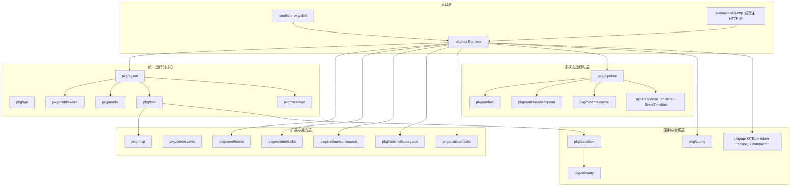

# agentkit 当前技术架构与核心技术细节

日期：2026-03-25

## 1. 文档定位

这份文档描述的是 `agentkit` 当前代码实现对应的技术架构，而不是早期方案设计或竞品调研。

- 适用对象：SDK 使用者、维护者、二次开发者
- 判定原则：以 `pkg/` 下当前实现与测试为准
- 与旧文档关系：`docs/architecture.md` 更偏历史设计与调研；本文是“当前实现说明”

---

## 2. 项目定位

`agentkit` 是一个用 Go 实现的 Agent Runtime / SDK，核心目标不是只封装一次模型调用，而是提供一套可嵌入的 Claude Code 风格运行时能力，包括：

- Agent 循环
- Tool 调用与治理
- Middleware 六阶段拦截
- Hooks 生命周期执行
- MCP 外部工具桥接
- Sandbox 与权限控制
- Skills / Commands / Subagents / Tasks 扩展层
- 多模态输入与 artifact-first pipeline
- Checkpoint / Resume / Cache / Timeline
- CLI / HTTP / SDK 统一接入面

一句话概括：

> `agentkit` 的核心是“可治理、可扩展、可恢复的 Agent Runtime”，而不是单纯的模型适配层。

---

## 3. 总体分层

---

## 4. 核心设计原则

### 4.1 统一入口，分层执行

外部调用统一走 `pkg/api.Runtime`。它负责把配置、模型、工具、沙箱、扩展层、历史、追踪、多模态执行这些能力编排成一个完整运行时。

### 4.2 接口优先，具体实现可替换

项目大量使用小接口隔离具体实现，例如：

- `model.Model`
- `tool.Tool`
- `checkpoint.Store`
- `runtime/cache.Store`
- `tasks.Store`
- `skills.Handler`
- `subagents.Handler`

这让嵌入方可以替换模型、缓存、任务存储、checkpoint 存储，而不用改核心循环。

### 4.3 安全治理前置

工具不是直接裸跑。调用链中存在：

- sandbox 路径/网络/资源限制
- security 权限规则匹配
- hooks 审批与外部策略
- middleware 六阶段治理

### 4.4 多模态运行时不内建算法，只内建控制面

多模态能力不是把 OCR、ASR、转码器写进 SDK，而是把以下对象做成一等公民：

- `artifact`
- `tool result`
- `pipeline step`
- `cache key`
- `checkpoint`
- `timeline`

---

## 5. 关键包职责总览

| 包 | 角色 | 核心职责 |
|---|---|---|
| `pkg/api` | 统一入口 | 组装 runtime，暴露 `Run` / `RunStream` |
| `pkg/agent` | Agent 内核 | 模型循环、工具调用、迭代停止条件 |
| `pkg/middleware` | 运行时治理 | 六阶段拦截链 |
| `pkg/model` | 模型抽象 | provider-agnostic model request/response |
| `pkg/tool` | 工具系统 | 注册、schema、执行、MCP bridge、输出落盘 |
| `pkg/message` | 会话历史 | message/history clone、trim、session backing |
| `pkg/config` | 配置系统 | `.claude/settings*.json`、hooks、sandbox、MCP 等配置 |
| `pkg/core/hooks` | 生命周期 hook | shell hook 执行器、事件匹配、超时、once/async |
| `pkg/core/events` | 事件总线 | SDK 内部事件发布订阅 |
| `pkg/sandbox` | 资源隔离门面 | FS / Network / Resource policy 聚合 |
| `pkg/security` | 安全规则 | 路径校验、命令校验、权限规则匹配 |
| `pkg/runtime/skills` | 技能运行时 | skill 注册、匹配、执行 |
| `pkg/runtime/commands` | 命令运行时 | slash command 注册与执行 |
| `pkg/runtime/subagents` | 子代理调度 | subagent 注册、匹配、分发、上下文约束 |
| `pkg/runtime/tasks` | 任务系统 | task store、依赖、阻塞/解阻塞 |
| `pkg/mcp` | MCP 适配 | 连接 stdio/SSE/HTTP MCP server |
| `pkg/artifact` | 多模态对象模型 | artifact ref/meta/lineage/cache key |
| `pkg/pipeline` | 多模态编排 | step/batch/fanout/fanin/retry/checkpoint |
| `pkg/runtime/checkpoint` | 可恢复执行 | checkpoint store |
| `pkg/runtime/cache` | 结果缓存 | artifact pipeline result cache |
| `pkg/clikit` | CLI 支持层 | runtime adapter、流输出辅助 |

---

## 6. Runtime 入口层：`pkg/api`

`pkg/api.Runtime` 是整个项目的主装配器与主控制器。

### 6.1 `api.Options`

`api.Options` 提供运行时装配参数，主要分为几类：

- 入口上下文：`EntryPoint`、`ModeContext`
- 项目与配置：`ProjectRoot`、`ConfigRoot`、`EmbedFS`
- 模型：`Model`、`ModelFactory`、`ModelPool`、`SubagentModelMapping`
- 输出控制：`OutputSchema`、`OutputSchemaMode`
- 运行时控制：`MaxIterations`、`Timeout`、`TokenLimit`
- 工具与 MCP：`Tools`、`CustomTools`、`EnabledBuiltinTools`、`MCPServers`
- Hooks / Middleware：`TypedHooks`、`HookMiddleware`、`Middleware`
- 扩展能力：`Skills`、`Commands`、`Subagents`
- 安全：`SandboxOptions`、`PermissionRequestHandler`、`ApprovalQueue`
- 多模态：`CheckpointStore`、`CacheStore`
- 可观测性：`TokenTracking`、`TokenCallback`、`OTEL`
- 自动压缩：`AutoCompact`

### 6.2 `api.Request`

`api.Request` 支持两类入口：

1. 普通 prompt 驱动
2. pipeline 驱动

关键字段：

- `Prompt`
- `ContentBlocks`
- `Pipeline`
- `SessionID`
- `ResumeFromCheckpoint`
- `Model`
- `EnablePromptCache`
- `OutputSchema`
- `TargetSubagent`
- `ForceSkills`
- `Metadata`

### 6.3 `api.Response`

响应并不只是一段文本，而是聚合结果：

- `Result.Output`
- `Result.ToolCalls`
- `Result.Usage`
- `Result.Artifacts`
- `Result.Structured`
- `Result.CheckpointID`
- `Result.Interrupted`
- `Timeline`
- `SkillResults`
- `CommandResults`
- `Subagent`
- `HookEvents`
- `SandboxSnapshot`

### 6.4 Runtime 初始化阶段

`api.New()` 主要做这些事情：

1. 归一化 `Options`
2. 初始化 `config.FS`
3. 加载 `claude.md` 并并入 system prompt
4. 加载 `.claude/settings*.json`
5. 解析模型实例
6. 创建 sandbox 与 execution environment
7. 构建 commands / skills / subagents registry
8. 注册 builtin tools / custom tools / MCP tools
9. 创建 hooks executor、history store、token tracker、compactor、tracer
10. 安装 checkpoint/cache/task store 等运行时依赖

### 6.5 并发模型

`pkg/api` 明确实现了运行时并发约束：

- `Runtime` 自身带锁，保护可变状态
- 每个 `SessionID` 通过 `sessionGate` 保证互斥执行
- 同一 session 上并发 `Run` / `RunStream` 会返回 `ErrConcurrentExecution`
- `Runtime.Close()` 会等待 in-flight 请求结束

这意味着：

- runtime 是线程安全的
- session 级别是串行语义
- 宿主如果需要排队，应在外层做 session queue

### 6.6 历史与持久化

会话消息由 `historyStore` 管理，底层对象是 `pkg/message.History`。

特点：

- 内存 LRU 会话缓存
- 可选磁盘历史持久化
- cleanup 由 `settings.cleanupPeriodDays` 控制
- session 恢复时会回填历史

### 6.7 自动压缩与 token 统计

`pkg/api` 内部维护：

- `tokenTracker`
- `compactor`

当 token 超过限制且启用 `AutoCompact` 时，会触发总结压缩，把长对话压缩成摘要后继续运行。

---

## 7. Agent 内核：`pkg/agent`

`pkg/agent` 是最小且稳定的执行核心。

### 7.1 核心接口

- `Model.Generate(ctx, *Context) (*ModelOutput, error)`
- `ToolExecutor.Execute(ctx, ToolCall, *Context) (ToolResult, error)`

### 7.2 核心数据结构

- `Context`
- `ToolCall`
- `ToolResult`
- `ModelOutput`

### 7.3 执行循环

`Agent.Run()` 的执行顺序是：

1. `StageBeforeAgent`
2. 进入迭代
3. `StageBeforeModel`
4. 调用模型 `Generate`
5. `StageAfterModel`
6. 如果模型结束，则 `StageAfterAgent` 并退出
7. 否则逐个执行 tool：
   - `StageBeforeTool`
   - `ToolExecutor.Execute`
   - `StageAfterTool`
8. 进入下一轮迭代

停止条件：

- `ModelOutput.Done == true`
- `len(ToolCalls) == 0`
- 超过 `MaxIterations`
- `context` 超时或取消
- middleware / model / tool 返回错误

### 7.4 设计特点

- `pkg/agent` 不直接关心 MCP、skills、checkpoint 这些高层概念
- 它只做“模型循环 + 工具结果回填”
- 因此 `pkg/api` 可以把多种高层能力压到这个稳定内核之上

---

## 8. Middleware：六阶段治理链

`pkg/middleware` 提供六个固定拦截点：

- `StageBeforeAgent`
- `StageBeforeModel`
- `StageAfterModel`
- `StageBeforeTool`
- `StageAfterTool`
- `StageAfterAgent`

### 8.1 作用

它不是事件总线，而是同步治理链，适合做：

- 审计
- prompt 预处理
- 输出过滤
- tool 参数治理
- token / latency 记录
- session 级扩展逻辑

### 8.2 设计特点

- 顺序执行
- 支持超时包装
- 首个错误短路
- 通过 `middleware.State` 在阶段间共享数据

### 8.3 与 hooks 的区别

- middleware：进程内、同步、类型化、适合治理
- hooks：进程外 shell / prompt / agent hook，适合集成外部策略

---

## 9. 模型层：`pkg/model`

`pkg/model` 是 provider-agnostic 抽象层。

### 9.1 模型协议

`model.Model` 对外暴露：

- `Complete(ctx, Request) (*Response, error)`
- `CompleteStream(ctx, Request, StreamHandler) error`

### 9.2 消息模型

`model.Message` 同时支持：

- `Content string`
- `ContentBlocks []ContentBlock`
- `Artifacts []artifact.ArtifactRef`
- `ToolCalls []ToolCall`
- `ReasoningContent`

这使得模型层已经具备：

- 文本对话
- 图像/文档输入
- 工具调用结果回写
- artifact 引用透传

### 9.3 Provider 模式

当前主要 provider 抽象：

- `AnthropicProvider`
- `OpenAIProvider`
- `Provider` / `ProviderFunc`

设计特点：

- provider 懒实例化
- 可选 TTL 缓存
- 线程安全的双重检查缓存

### 9.4 输出约束

`ResponseFormat` 支持：

- `text`
- `json_object`
- `json_schema`

`api.OutputSchemaMode` 支持两种策略：

- `inline`
- `post_process`

这让结构化输出既能内联约束，也能在 agent loop 后单独格式化。

---

## 10. 工具系统：`pkg/tool`

### 10.1 核心接口

每个工具实现：

- `Name() string`
- `Description() string`
- `Schema() *JSONSchema`
- `Execute(ctx, params) (*ToolResult, error)`

### 10.2 `ToolResult` 已经多模态化

当前 `ToolResult` 不再只是 `Output string`，还支持：

- `Output`
- `Summary`
- `OutputRef`
- `ContentBlocks`
- `Artifacts`
- `Structured`
- `Preview`
- `Data`

这意味着工具输出可以被上层分别消费为：

- 人类可读文本
- UI preview
- 结构化 JSON
- artifact 流转对象

### 10.3 执行器

`tool.Executor` 负责：

1. registry 查找
2. sandbox 权限检查
3. approval / permission resolver
4. tool 执行
5. 可选输出落盘
6. 返回 `CallResult`

### 10.4 并发执行

`ExecuteAll()` 支持并发执行多个调用，并保持结果顺序与输入一致。

### 10.5 MCP 工具桥接

MCP server 的远端工具会被注册成本地 tool 形态，从而进入统一执行面。

这带来的收益是：

- MCP 工具和 builtin/custom tool 共享同一套 sandbox / registry / executor 语义
- 上层 agent 不需要区分“本地工具”还是“MCP 工具”

---

## 11. 消息与会话层：`pkg/message`

`pkg/message` 是运行时消息历史的基础设施层。

### 11.1 职责

- 保存 `Message`
- clone message，避免引用污染
- history append/replace/read
- token trimming

### 11.2 关键特点

- 历史对象是线程安全的
- 返回值都是 clone，避免外部修改内部状态
- `Trimmer` 可以根据 token 预算裁剪消息

### 11.3 角色定位

它不负责 session LRU、磁盘持久化、Run 语义；这些由 `pkg/api` 完成。

---

## 12. 配置层：`pkg/config`

项目的声明式配置中心在 `.claude/`。

### 12.1 `Settings`

`pkg/config.Settings` 聚合了主要运行时配置：

- API key helper
- cleanup policy
- permissions
- hooks
- model
- MCP servers
- sandbox
- bash/tool output persistence
- status line
- output style
- `RespectGitignore`

### 12.2 配置特点

- optional bool 使用 `*bool`，区分“未设置”和“显式 false”
- 支持默认值与校验
- 运行时可监听规则变化
- `EmbedFS` 支持把 `.claude` 打包到二进制

---

## 13. Hooks 与事件系统

### 13.1 Hooks：`pkg/core/hooks`

Hooks 是面向 Claude Code 风格生命周期的外部扩展机制。

支持：

- command hook
- prompt hook
- agent hook

关键能力：

- event type 匹配
- selector 过滤
- timeout
- async
- once
- status message

exit code 语义：

- `0`：成功，解析 JSON 输出
- `2`：blocking error
- 其他：non-blocking

### 13.2 事件总线：`pkg/core/events`

事件总线用于 SDK 内部松耦合事件传播。

特点：

- 发布订阅
- 订阅独立 goroutine
- 去重窗口
- 可配置超时

典型用途：

- hooks 事件广播
- MCP tools changed
- 观测与审计集成

---

## 14. Sandbox 与 Security

### 14.1 `pkg/sandbox`

`sandbox.Manager` 是门面层，聚合三类策略：

- `FileSystemPolicy`
- `NetworkPolicy`
- `ResourcePolicy`

执行时统一走：

- `CheckPath`
- `CheckNetwork`
- `CheckUsage`
- `Enforce`

### 14.2 `pkg/security`

`pkg/security.Sandbox` 是更底层的安全实现，负责：

- 路径边界检查
- 命令校验
- 权限规则加载
- tool permission 匹配
- permission audit

### 14.3 权限模型

权限规则支持三类动作：

- `allow`
- `ask`
- `deny`

优先级：

`deny > ask > allow`

规则来源：

- `.claude/settings*.json`
- `PermissionsConfig`

### 14.4 安全分层

整个项目的工具安全不是单点实现，而是多层叠加：

1. registry 只注册允许的工具
2. sandbox 检查路径/网络/资源
3. security permission matcher 解析 allow/ask/deny
4. 可选 approval queue / host callback 做人工批准
5. hooks / middleware 再做附加治理

---

## 15. Skills / Commands / Subagents / Tasks

这是 `agentkit` 与“纯模型 SDK”最不同的一层。

### 15.1 Skills

`pkg/runtime/skills` 提供：

- `Definition`
- `Matcher`
- `Registry`
- `ActivationContext`
- `Handler`

特点：

- 支持自动匹配激活
- 支持手动强制调用
- 支持优先级与互斥组

### 15.2 Commands

`pkg/runtime/commands` 为 slash command 提供声明式注册与执行，适合 CLI / REPL 指令面。

### 15.3 Subagents

`pkg/runtime/subagents` 提供：

- builtin subagent 类型目录
- handler 驱动的调度执行
- 自动匹配或显式 target 分发
- tool whitelist / model / metadata 约束

内建类型包括：

- `general-purpose`
- `explore`
- `plan`

### 15.4 Tasks

`pkg/runtime/tasks` 提供线程安全任务存储。

能力包括：

- 创建 / 更新 / 删除任务
- 状态变迁
- 依赖关系
- block / unblock
- snapshot

这让运行时可以支持异步 bash、审批等待、长任务追踪等上层模式。

---

## 16. MCP 集成：`pkg/mcp`

MCP 是项目的外部工具扩展关键路径之一。

### 16.1 支持形态

可连接：

- stdio
- SSE
- streamable/http

### 16.2 角色定位

`pkg/mcp` 负责把远端 MCP server 变成当前 runtime 可消费的能力源。

### 16.3 运行机制

1. 根据 spec 建立 session transport
2. 建立 `ClientSession`
3. 初始化 MCP session
4. 枚举远端工具
5. 桥接为本地 tool 注册到 runtime

### 16.4 结果

上层 agent / tool executor 看见的是统一工具接口，不需要关心底层 transport。

---

## 17. 多模态运行时新增核心：artifact-first substrate

这是当前项目最重要的新能力之一。

### 17.1 Artifact 模型：`pkg/artifact`

核心类型：

- `ArtifactKind`
- `ArtifactSource`
- `ArtifactMeta`
- `ArtifactRef`
- `Artifact`

支持的逻辑种类：

- `image`
- `document`
- `audio`
- `video`
- `text`
- `json`
- `binary`

### 17.2 Lineage

`LineageGraph` 用于记录 artifact 的派生关系：

- parent
- child
- operation

这让运行时可以表达：

- 输入资产来自哪里
- 哪个 step 产生了哪个 artifact
- 某个 artifact 的祖先链是什么

### 17.3 Cache Key

`artifact.NewCacheKey()` 基于以下内容生成确定性 key：

- tool/skill 名称
- step 参数
- input artifact refs

特性：

- 参数和 refs 做归一化
- 结果稳定、可复现
- 为 pipeline cache 提供基础原语

---

## 18. Pipeline：`pkg/pipeline`

`pkg/pipeline` 是轻量级多模态编排层，不是重型 DAG 引擎。

### 18.1 声明模型

核心结构：

- `Step`
- `Batch`
- `FanOut`
- `FanIn`
- `Conditional`
- `Retry`
- `Checkpoint`

### 18.2 执行器

`pipeline.Executor` 通过注入执行面工作：

- `RunTool`
- `RunSkill`
- `Cache`

它并不自己实现 tool 或 skill，而是把步骤调度到上层提供的运行面。

### 18.3 执行语义

- `Batch`：顺序执行
- `FanOut`：按 artifact collection 展开
- `FanIn`：聚合 `Items`
- `Retry`：有限次数重试
- `Checkpoint`：声明可恢复边界
- leaf step：执行 tool 或 skill

### 18.4 Pipeline Result

每个步骤可返回：

- `Output`
- `Summary`
- `Artifacts`
- `Structured`
- `Preview`
- `Items`
- `Lineage`

### 18.5 设计定位

这层的目标不是替代 LangGraph 一类通用编排框架，而是为多模态 runtime 提供：

- 够用的步骤控制
- 可缓存
- 可恢复
- 可追踪

---

## 19. Checkpoint / Resume / Cache

### 19.1 Checkpoint：`pkg/runtime/checkpoint`

`checkpoint.Store` 接口定义：

- `Save`
- `Load`
- `Delete`

`checkpoint.Entry` 保存：

- `ID`
- `SessionID`
- `Remaining *pipeline.Step`
- `Input`
- `Result`
- `CreatedAt`

当前内置实现：

- memory store
- file-backed JSON store

### 19.2 Resume 语义

pipeline-backed request 在中断后可通过：

- `Request.ResumeFromCheckpoint`

恢复剩余步骤执行。

### 19.3 Cache：`pkg/runtime/cache`

`cache.Store` 接口定义：

- `Load`
- `Save`

当前内置实现：

- memory store
- file-backed JSON store

缓存的值是 step 对应的 `tool.ToolResult`，key 是 deterministic artifact cache key。

---

## 20. Timeline 与可观测性

### 20.1 `api.TimelineEntry`

当前 pipeline / multimodal 执行会记录 timeline，事件种类包括：

- `input_artifact`
- `generated_artifact`
- `tool_call`
- `tool_result`
- `cache_hit`
- `cache_miss`
- `checkpoint_create`
- `checkpoint_resume`
- `token_snapshot`
- `latency_snapshot`

### 20.2 输出位置

timeline 会出现在两个位置：

- `api.Response.Timeline`
- `RunStream` 的 `EventTimeline`

### 20.3 其他可观测能力

除了 timeline，运行时还提供：

- token tracking
- model turn recorder
- sandbox snapshot
- hook event capture
- OTEL tracer

### 20.4 OTEL

`pkg/api` 提供 tracer 抽象：

- 默认无 `otel` build tag 时为 no-op
- 启用后可产生 agent/model/tool span

这保持了：

- 核心默认零额外负担
- 需要时可接入分布式追踪

---

## 21. 流式输出模型

`RunStream` 使用 Anthropic 风格 SSE 事件模型，并扩展 agent runtime 事件。

### 21.1 兼容事件

- `message_start`
- `content_block_start`
- `content_block_delta`
- `content_block_stop`
- `message_delta`
- `message_stop`
- `ping`

### 21.2 Runtime 扩展事件

- `agent_start`
- `agent_stop`
- `iteration_start`
- `iteration_stop`
- `tool_execution_start`
- `tool_execution_output`
- `tool_execution_result`
- `timeline`
- `error`

### 21.3 设计意义

这样 CLI、HTTP SSE、嵌入式 UI 都能在同一事件流上消费：

- 文本生成
- tool 过程
- multimodal timeline
- 错误状态

---

## 22. 典型执行路径

### 22.1 普通 Prompt Run

1. 外部调用 `Runtime.Run`
2. 获取 session gate
3. 加载历史与配置
4. 执行 command / skill / subagent 前置逻辑
5. 组装 agent context 与 model request
6. 进入 `pkg/agent` 循环
7. 工具执行结果回写
8. 更新 token / hooks / history
9. 返回 `api.Response`

### 22.2 Pipeline Run

1. 请求携带 `Request.Pipeline`
2. runtime 创建 pipeline executor
3. 步骤逐层执行
4. 读取 / 写入 cache
5. 需要时创建 checkpoint
6. 聚合 artifacts / structured / timeline
7. 返回 pipeline-backed response

### 22.3 Resume Run

1. 请求携带 `ResumeFromCheckpoint`
2. runtime 从 checkpoint store 加载 entry
3. 恢复 remaining step 与 input/result
4. 继续执行剩余 pipeline
5. 清理或覆盖 checkpoint

---

## 23. 当前项目的技术特点总结

从代码实现看，`agentkit` 当前最重要的技术特征是：

### 23.1 它不是单一 agent loop，而是完整 runtime

项目真正的价值集中在：

- runtime 装配
- 安全治理
- 扩展层协议
- 多模态控制面

### 23.2 它把“可恢复执行”做进了运行时主干

checkpoint、cache、timeline 不是外挂 demo，而是已经进入 `api.Request` / `api.Response` 与 `RunStream`。

### 23.3 它采用“轻内核 + 强扩展”的结构

- 内核保持小接口和稳定循环
- 高层能力通过 registry / handler / store 注入

### 23.4 它对宿主友好

SDK 可以嵌入：

- CLI
- HTTP 服务
- 企业平台
- CI/CD
- 本地 agent 应用

---

## 24. 读代码建议顺序

如果要从源码理解项目，建议顺序如下：

1. `pkg/api/options.go`
2. `pkg/api/agent.go`
3. `pkg/agent/agent.go`
4. `pkg/model/interface.go`
5. `pkg/tool/tool.go` 与 `pkg/tool/executor.go`
6. `pkg/middleware/*`
7. `pkg/sandbox/*` 与 `pkg/security/*`
8. `pkg/runtime/skills` / `subagents` / `tasks`
9. `pkg/artifact` / `pkg/pipeline`
10. `pkg/runtime/checkpoint` / `pkg/runtime/cache`

---

## 25. 与现有文档的关系

- `docs/architecture.md`
  - 历史调研和早期设计说明
- `docs/api-reference.md`
  - 细粒度 API 参考
- `docs/current-architecture.zh-CN.md`
  - 当前实现的总架构与技术细节地图
- `docs/2026-03-24-multimodal-skill-runtime-architecture.zh-CN.md`
  - 多模态 runtime 专项分析

---

## 26. 结论

当前的 `agentkit` 已经具备一个现代 Agent Runtime 的核心骨架：

- 有稳定的 agent loop
- 有统一运行时入口
- 有工具、技能、子代理、任务扩展面
- 有安全、权限、沙箱、hooks 治理面
- 有多模态 artifact-first pipeline substrate
- 有 checkpoint / cache / timeline 等生产化基础设施

如果从架构形态判断，它已经不是“模型 SDK + 几个工具”的阶段，而是一个明确朝着“可嵌入、可治理、可恢复、可扩展”的 Agent Runtime 演进中的系统。
